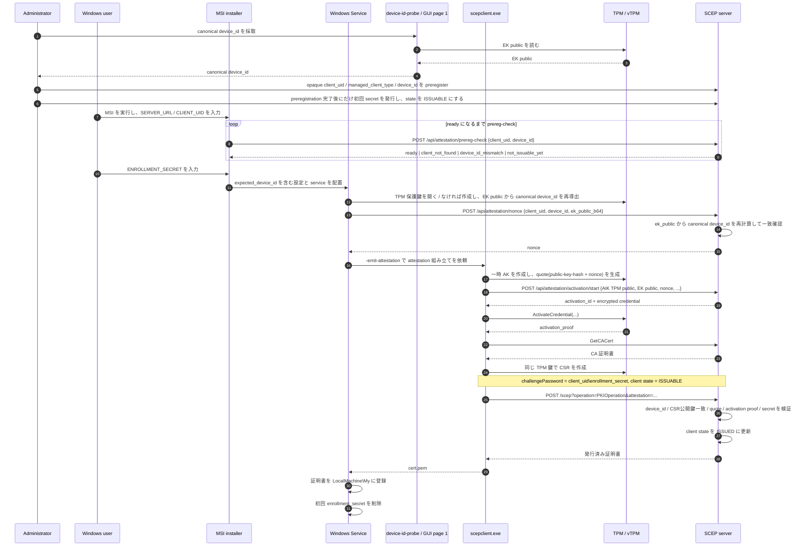
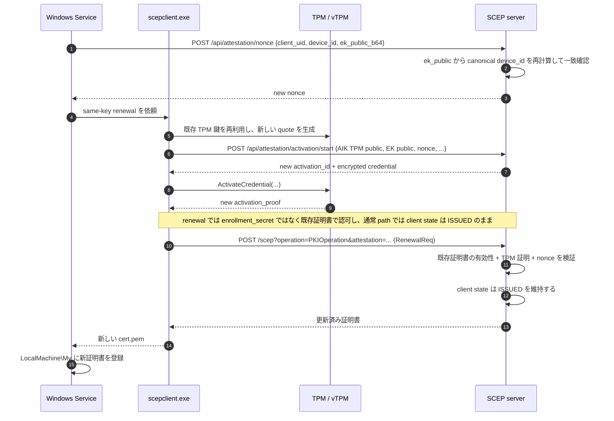

# Windows と SCEP サーバーの証明書やり取り

この文書は、現在の実装で **Windows 側の service / helper / TPM** と **SCEP サーバー** の間で、実際に何がやり取りされ、各段階で内部的に何が行われるかを、できるだけ平易に整理したものです。

対象は主に次の 2 つです。

- 初回発行
- 自動更新

この文書でいう Windows 側の実装は、MSI で導入される **Windows Service** と、同梱 helper である `scepclient.exe` を指します。

## 先に全体像

現在のフローは、大きく分けると次の順番です。

1. GUI MSI の 1 ページ目、または silent install 用 `device-id-probe` が、`EK public` 由来の canonical `device_id` を採取する
2. 管理者がサーバー側で opaque `client_uid` / `managed_client_type=windows-msi` / canonical `device_id` を preregister する
3. 管理者が preregistration 完了後にだけ初回発行用 `enrollment_secret` を発行し、client state を `INACTIVE -> ISSUABLE` にする
4. GUI MSI または silent bootstrap が prereg-check で `device_id` 一致と readiness を確認する
5. Windows Service が TPM 保護鍵を用意し、同じ規則で canonical `device_id` を再導出する
6. Windows が `ek_public_b64` を添えてサーバーから一回限りの `nonce` を受け取る
7. Windows が TPM を使って「この端末の今回の申請です」という証明データを作る
8. Windows が `CSR` を `SCEP` でサーバーへ送る
9. サーバーが canonical `device_id` binding、TPM 証明、初回 secret または既存証明書を検証する
10. サーバーが証明書を返し、初回発行なら client state を `ISSUED` にする
11. Windows が証明書を `LocalMachine\My` に入れる
12. 通常の自動更新は `ISSUED` のまま `既存証明書 + TPM 証明` で継続する

## 主な登場人物

| 登場人物 | 役割 |
|---|---|
| Windows user | MSI を起動して初期設定を入れる人 |
| MSI installer | 設定と service をマシンに配置するインストーラー |
| Windows Service | 鍵の準備、更新判定、helper 呼び出し、証明書格納を担当 |
| `scepclient.exe` | TPM 証明の組み立てと SCEP 通信を担当する helper |
| `TPM` / `vTPM` | 秘密鍵を外へ出さずに保持し、署名や証明を行う保護領域 |
| SCEP server | 申請受付、TPM 証明確認、証明書発行を担当 |
| CA | 証明書に最終署名する認証局。実装上は server 側に含まれる |

## 用語の説明

### SCEP

証明書を発行・更新するための通信手順です。Windows はこの手順を使ってサーバーへ申請します。

### CSR

`Certificate Signing Request` の略です。証明書署名要求、つまり「この公開鍵に対して、この名前の証明書をください」という申請書です。

### `client_uid`

サーバーに登録されているクライアント識別子です。Windows MSI 管理対象では、unauthenticated prereg-check endpoint を前提に、高 entropy の opaque ID を使います。現在の実装では、CSR の `Common Name` にもこの値が入ります。

### `device_id`

端末識別子です。Windows MSI 管理対象では手入力値ではなく、`EK public` を `SubjectPublicKeyInfo` DER に正規化し、その全体に対する `SHA-256` を lowercase 64 文字の 16 進文字列にした canonical 値を使います。

管理者は GUI MSI の 1 ページ目または `device-id-probe` でその canonical 値を採取し、サーバーへ事前登録します。Windows Service / helper も実行時に同じ規則で `device_id` を再導出し、申請に含めます。

### `enrollment_secret`

初回発行だけで使う秘密文字列です。MSI で設定され、初回発行成功後は Windows 側から削除されます。

### `nonce`

一回限りの乱数です。使い回しやリプレイ攻撃を防ぐために、サーバーが発行し、最後の検証で消費します。

### TPM

秘密鍵を OS から直接抜き出せない形で扱うための保護領域です。GCP では物理 TPM ではなく `vTPM` という仮想 TPM を使います。

### CNG / NCrypt

Windows の暗号 API です。今回の実装では TPM 鍵を直接触るのではなく、主にこの API を経由して使います。

### `AIK` / `AK`

TPM が「これは TPM が作った証拠です」と署名するときに使う鍵です。

実装では `AK` (`Attestation Key`) という名前が出てきますが、役割としては `AIK` (`Attestation Identity Key`) と同じ種類の証明用鍵として見て差し支えありません。

### `quote`

TPM が、あるデータと TPM 状態をまとめて署名した証拠データです。今回の実装では、主に「今回の公開鍵」と「今回の `nonce`」に結びついていることを示すために使います。

### `EK public`

`EK` (`Endorsement Key`) の公開鍵です。TPM の身元側の鍵に相当します。今回の実装では `credential activation` に使います。

### `EK certificate`

`EK public` に対する証明書です。ある TPM メーカーや信頼チェーンが、その `EK public` を裏書きしているときに使います。

GCP の `vTPM` では、この `EK certificate` が取得できない場合があります。

### `credential activation`

サーバーが「その TPM だけが復元できる暗号化データ」を返し、TPM 側がそれを復元できたら本物とみなす手順です。

現在の GCP `vTPM` パスでは、`EK certificate` よりもこちらが重要です。

### `LocalMachine\My`

Windows の「マシン全体で使う証明書ストア」です。最終的に発行済み証明書はここへ入ります。

## 前提条件

Windows MSI 管理対象の正式 flow は、GUI MSI を primary にし、silent install では別配布の `device-id-probe` を使う前提にします。

初回発行の前に、次が完了している必要があります。

- GUI MSI の 1 ページ目、または `device-id-probe` が target Windows machine の `EK public` から canonical `device_id` を採取できること
- 高 entropy の opaque `client_uid`
- canonical `device_id`
- `managed_client_type=windows-msi`
- preregistration 完了後にだけ発行された one-time `enrollment_secret`

`managed_client_type=windows-msi` は、「このクライアントは Windows MSI 管理対象なので、EK-derived `device_id`、`credential activation`、CSR key binding を満たした要求だけを受け付ける」という意味です。

初回用 `enrollment_secret` は preregistration 完了後にだけ発行され、server 側 client state を `INACTIVE -> ISSUABLE` にします。

---

## Windows MSI 管理対象 client の状態遷移

Windows MSI 管理対象では、server 側 client state を次の 3 状態だけで運用します。

- `INACTIVE`
  - preregistration 済みだが、まだ初回発行用 secret を発行していない状態
  - expiry recovery や TPM / vTPM replacement 後に明示的に戻す状態でもある
- `ISSUABLE`
  - preregistration 完了後に初回または再 enrollment 用の one-time secret を発行済みで、enrollment を受け付ける状態
- `ISSUED`
  - 有効なクライアント証明書があり、通常の自動更新を受け付ける状態

Windows MSI の正式ライフサイクルは、次を前提にします。

- 初回発行: `INACTIVE -> ISSUABLE -> ISSUED`
- 自動更新: `ISSUED -> renewal -> ISSUED`
- expiry recovery: `ISSUED -> INACTIVE -> ISSUABLE -> ISSUED`
- TPM / vTPM replacement: 管理者が `device_id` を更新し、旧証明書を revoke したうえで `INACTIVE -> ISSUABLE -> ISSUED`

`UPDATABLE` / `PENDING` は server 全体には残り得ますが、`managed_client_type=windows-msi` では使いません。update-secret を使う manual / legacy flow は Windows MSI 管理対象から外します。

---

## 初回発行の時系列

### 0. GUI MSI または `device-id-probe` が canonical `device_id` を出す

GUI MSI の primary flow では、1 ページ目が `EK public` から canonical `device_id` を計算して表示します。

silent install では別配布の `device-id-probe` を使います。これは通常は人間向け表示を行い、`--json` で machine-readable output も返します。

### 1. 管理者が preregistration を完了させる

server 側では次を行います。

1. 高 entropy の opaque `client_uid` を払い出す
2. canonical `device_id` を登録する
3. `managed_client_type=windows-msi` を登録する
4. preregistration 完了後にだけ初回発行用 `enrollment_secret` を発行し、client state を `ISSUABLE` にする

### 2. GUI MSI が prereg-check を行う

GUI MSI は次の入力を受け取ります。

- `SERVER_URL`
- `CLIENT_UID`

その後、read-only prereg-check endpoint に対して、local machine で再導出した canonical `device_id` を添えて問い合わせます。

server が返すのは限定的 reason code だけです。

- `client_not_found`
- `device_id_mismatch`
- `not_issuable_yet`
- `ready`

`not_issuable_yet` の場合、GUI MSI は同じ画面で `Retry` できるようにし、ready になるまで先へ進ませません。

prereg-check 成功後にだけ、GUI MSI は `ENROLLMENT_SECRET` の入力と install 実行を許可します。

silent install でも同じ prereg-check を実施し、ready でなければ bootstrap を fail-fast で止めます。

### 3. Windows Service が設定を読み、初回発行の準備に入る

Service はレジストリなどから設定を読みます。`enrollment_secret` は Windows の保護機構である `DPAPI Machine Scope` に移せる形に整理されます。

ここでの目的は、「初回 secret を平文のまま長く残さない」ことと、「`expected_device_id` を local safety rail として保持する」ことです。

### 4. Windows Service が TPM 保護鍵を開くか、新規作成する

Service は Windows の `CNG` / `NCrypt` を通して、`Microsoft Platform Crypto Provider` を使い、機械用の TPM 保護鍵を準備します。

この鍵の秘密鍵は TPM 内にあり、OS からファイルとして取り出されません。外へ出せるのは公開鍵だけです。

この段階で Service / helper は `EK public` を読み出し、GUI MSI や `device-id-probe` と同じ規則で canonical `device_id` を再導出します。つまり、runtime に使う `device_id` は「`EK public` の `SPKI DER` -> `SHA-256` -> lowercase hex」で決まります。

Service が再導出した値が local config の `expected_device_id` と一致しない場合、Service は blocked / mismatch state に入り、enrollment / renewal を止めて管理者対応を待ちます。

### 5. Windows が server から `nonce` を取得する

Windows Service は次の API を呼びます。

- `POST /api/attestation/nonce`

Windows が渡すもの:

- `client_uid`
- `device_id`
- `ek_public_b64`

server が内部で行うこと:

1. `client_uid` が登録済みか確認する
2. `managed_client_type=windows-msi` の対象か確認する
3. `ek_public_b64` から canonical `device_id` を再計算する
4. 登録済み `device_id` と request `device_id` の両方に一致するか確認する
5. ランダムな `nonce` を生成する
6. その `nonce` を `client_uid + device_id` にひも付けて短時間だけ保持する

server が返すもの:

- `nonce`
- `device_id`
- `expires_at`

この `nonce` は、あとで TPM 証明の中に入ります。

### 6. Windows Service が helper に attestation 組み立てを依頼する

Service は `scepclient.exe -emit-attestation` を呼びます。

helper に渡す主なもの:

- `server_url`
- `client_uid`
- `device_id`
- TPM 鍵の provider 名
- TPM 鍵名
- 申請に使う公開鍵の `SPKI`
- さきほど受け取った `nonce`

ここで `SPKI` (`SubjectPublicKeyInfo`) とは、公開鍵の標準的な表現形式です。

### 6. helper が TPM で証明材料を作る

helper は TPM を開き、証明専用の一時鍵である `AK` を作ります。

そのうえで、主に次を取得・生成します。

- `AIK public`
- `AIK TPM public`
- `quote`
- `quote_signature`
- `EK public`
- 取得できれば `EK certificate`

この `quote` には、実装上「申請する公開鍵のハッシュ + `nonce`」が入るようにしています。これにより server は、「この TPM 証明は今回の申請公開鍵と今回の `nonce` に結びついている」と確認できます。

### 7. helper が `credential activation` を開始する

Windows 管理対象 client では、helper はさらに次の API を呼びます。

- `POST /api/attestation/activation/start`

helper が渡す主なもの:

- `client_uid`
- `device_id`
- `nonce`
- `AIK TPM public`
- `AIK create data`
- `AIK create attestation`
- `AIK create signature`
- `EK public`

server が内部で行うこと:

1. `client_uid` と `device_id` を再確認する
2. その `nonce` がまだ存在しているか確認する
3. `EK public` と `AIK` の作成情報をもとに、**その TPM だけが復元できる暗号化データ**を作る
4. そのときの正解 secret を server 側メモリに一時保存する
5. `activation_id` と暗号化済み credential を返す

ここでは `nonce` はまだ消費されません。消費されるのは、最後の本番検証が通ったときです。

### 8. helper が TPM に `ActivateCredential` を実行させる

helper は server から受け取った暗号化済み credential を TPM に渡し、`ActivateCredential` を実行します。

TPM が内部で行うこと:

- `EK` に対応する秘密側の能力を使って credential を復元する
- `AK` にひも付いた正しい復元値を返す

helper が得るもの:

- `activation_proof_b64`

これは「本当にその TPM が応答した」ことを示す証拠です。

### 9. helper が最終 `attestation` を組み立てる

最終的な `attestation` には、主に次が入ります。

- `device_id`
- 申請公開鍵の `public_key_spki_b64`
- `nonce`
- `AIK public`
- `AIK TPM public`
- `quote`
- `quote_signature`
- `EK public`
- 取得できれば `EK certificate`
- `activation_id`
- `activation_proof_b64`

Service は helper から返ってきた `attestation` をそのまま信用せず、内部で最低限次を確認します。

- `device_id` が想定どおりか
- `nonce` が一致するか
- 公開鍵が一致するか
- 必須の TPM 証明項目が入っているか

### 10. helper が SCEP 用の CA 証明書を取りに行く

helper はまず SCEP server に対して `GetCACert` を行い、CA 証明書を受け取ります。

これは「この申請をどの CA 向けに暗号化するか」を決めるために必要です。

### 11. helper が CSR を作る

helper は、Windows 側の TPM 保護鍵を使って CSR を作ります。

CSR の主な中身:

- 公開鍵
- `Common Name = client_uid`
- 初回発行なら `challengePassword = client_uid\enrollment_secret`

ここで `challengePassword` は SCEP が持つ既存の項目です。今回の実装ではこの欄に `client_uid\enrollment_secret` を入れています。

### 12. helper が SCEP の `PKIOperation` を送る

初回発行では helper は `PKCSReq` として申請を送ります。

Windows から server へ渡る主なもの:

- SCEP メッセージ本体
  - CSR
  - 初回用の `challengePassword`
- URL クエリの `attestation`

実装上は概ね次の形です。

- `POST /scep?operation=PKIOperation&attestation=...`

初回発行では、まだ本物のクライアント証明書がないため、helper は **一時的な自己署名証明書** を使って SCEP メッセージの署名や復号を行います。これは最終配布証明書ではありません。

### 13. server が attestation を検証する

server は SCEP メッセージと `attestation` を受け取り、attestation middleware でまず検証します。

server が内部で行うこと:

1. `challengePassword` から候補の `client_uid` を取り出す
2. その client の登録情報を読み、登録済み `device_id` を取得する
3. `attestation` の `device_id` と一致するか確認する
4. CSR の公開鍵を取り出す
5. `attestation` に入っている公開鍵と CSR 公開鍵が一致するか確認する
6. `quote` の署名を `AIK public` で検証する
7. `quote` の中身が「今回の公開鍵 + 今回の `nonce`」と一致するか確認する
8. Windows 管理対象なら `activation_id` と `activation_proof_b64` があるか確認する
9. server 側で保存していた activation secret と `activation_proof_b64` が一致するか確認する
10. `nonce` が未使用か確認し、最後に消費する

ここで失敗すると、たとえば次のような理由で拒否されます。

- `device_id_mismatch`
- `public_key_mismatch`
- `invalid_quote_signature`
- `nonce_mismatch`
- `missing_activation_proof`
- `invalid_activation_proof`

### 14. server が初回用 secret も検証する

attestation 検証が通ると、その次に challenge middleware が動きます。

server が内部で行うこと:

1. `challengePassword` を `client_uid\secret` に分解する
2. 登録済み secret と一致するか確認する
3. client の状態が `ISSUABLE` であることを確認する

つまり初回発行では、最終的に次の両方が通る必要があります。

- TPM 由来の証明
- 初回発行 secret

管理者が one-time secret を発行するのは、この初回発行 path のためだけです。

### 15. server が証明書を発行する

CSR と各種検証が通ると、server 側の CA が CSR の公開鍵に対してクライアント証明書を署名します。

この初回発行 path では、server 側 client state は `ISSUABLE -> ISSUED` になります。

server から helper へ返るもの:

- 発行済みクライアント証明書

### 16. Windows が証明書を保存し、Machine Store に入れる

helper は返ってきた証明書を受け取り、managed directory の `cert.pem` に保存します。

その後 Windows Service は、その証明書を `LocalMachine\My` に登録します。このとき Windows 側では、証明書と TPM 鍵を結び付けます。

ここで重要なのは、**秘密鍵は TPM から外へ出ない** ことです。Linux のように `key.pem` が置かれるのではなく、鍵は TPM / CNG 側に残ります。

### 17. Windows が初回 secret を削除する

初回発行が成功したら、Windows Service は `enrollment_secret` を削除します。

これ以降の更新では、この secret は使いません。

---

## 初回発行の時系列図

---

## 自動更新の時系列

### 1. Windows Service が現在の証明書を監視する

Service は `LocalMachine\My` と managed directory を見て、現在の証明書の期限を確認します。

更新期間に入ると、状態は `RenewalDue` になります。

### 2. 同じ TPM 鍵を再利用する

現在の実装は **same-key renewal** です。

これは、「秘密鍵は作り直さず、同じ TPM 鍵をそのまま使って、新しい証明書だけを取る」という意味です。

### 3. 更新用の `nonce` をもう一度取りに行く

更新でも、Windows は再度 `POST /api/attestation/nonce` を呼びます。

理由は、TPM 証明を毎回 fresh に取り直すためです。前回の `nonce` を使い回しません。

### 4. 更新用の attestation をもう一度作る

helper は初回と同じように、新しい `quote`、新しい `activation_id`、新しい `activation_proof_b64` を作ります。

つまり更新であっても、TPM 由来の証明は毎回やり直します。

### 5. helper が更新用の SCEP リクエストを送る

更新では helper は `RenewalReq` を送ります。

このときの違い:

- 初回用 `enrollment_secret` は使わない
- 既存証明書を使って SCEP メッセージに署名する

つまり、更新の認可は「すでに正しく発行された既存証明書を持っているか」で行います。

ここで重要なのは、通常の Windows MSI 自動更新の前に、管理者が新しい secret を発行したり client state を `UPDATABLE` にしたりする必要はないことです。

### 6. server が既存証明書ベースで更新権限を確認する

更新時の server の確認ポイントは次です。

1. SCEP メッセージに署名した既存証明書が有効か
2. その証明書の `Common Name` から `client_uid` を引けるか
3. その証明書が server 側で active な既発行証明書か
4. `device_id`
5. CSR 公開鍵一致
6. `quote`
7. `activation_proof_b64`
8. `nonce`

つまり更新は、

- **既存証明書による本人確認**
- **TPM による端末確認**

の組み合わせです。

通常の Windows MSI 自動更新では、server 側 client state は `ISSUED` のままでよく、更新成功後も `ISSUED` に戻ります。

### 補足: `UPDATABLE` / `PENDING` が使われるのはどんなときか

`UPDATABLE` / `PENDING` は、server 全体の generic/legacy client には残り得ますが、`managed_client_type=windows-msi` では使いません。

そのため、「Windows MSI の自動更新が失敗するたびに管理者が secret を再発行する」「Windows MSI client を `UPDATABLE` にして update-secret flow へ逃がす」という運用は、この文書の target path に含めません。

### 7. server が更新済み証明書を返し、Windows が差し替える

server は新しい証明書を返します。

Windows Service はその証明書を再び `LocalMachine\My` に登録します。証明書の thumbprint は変わりますが、使っている TPM 鍵名は同じままです。

---

## 自動更新の時系列図

---

## 何が何を渡しているかの一覧

| 送信元 | 送信先 | 渡すもの | 目的 |
|---|---|---|---|
| GUI page 1 / `device-id-probe` | 管理者 | canonical `device_id` | preregistration に使う TPM identity を提示する |
| GUI MSI | server `/api/attestation/prereg-check` | `client_uid`, `device_id` | preregistration 完了と `device_id` 一致を確認する |
| Windows Service | server `/api/attestation/nonce` | `client_uid`, `device_id`, `ek_public_b64` | 今回の申請専用 `nonce` を受け取る |
| server | Windows Service | `nonce`, `expires_at` | 一回限りの証明用乱数を渡す |
| helper | server `/api/attestation/activation/start` | `client_uid`, `device_id`, `nonce`, `AIK TPM public`, `EK public`, AIK 作成情報 | TPM が本物か追加確認するための準備 |
| server | helper | `activation_id`, 暗号化 credential | TPM だけが復元できる確認データを渡す |
| TPM | helper | `activation_proof` | 本当にその TPM が応答したことを示す |
| helper | server `GetCACert` | なし | CA 証明書を取得する |
| server | helper | CA 証明書 | SCEP の暗号化先・検証先を知らせる |
| helper | server `PKIOperation` | CSR, `challengePassword` または既存証明書, `attestation` | 本番の証明書発行申請 |
| server | helper | 発行済み証明書 | Windows に最終証明書を返す |
| helper / Service | Windows Machine Store | 証明書 | `LocalMachine\My` に証明書を登録する |

---

## 各コンポーネントが内部で行っていること

### Windows Service がやっていること

- MSI で入った設定を読む
- `expected_device_id` と runtime 再導出値の一致を確認し、不一致なら blocked state に入る
- `enrollment_secret` の扱いを整理する
- TPM 保護鍵を用意する
- `nonce` を取得する
- helper に attestation 組み立てを依頼する
- 発行済み証明書を `LocalMachine\My` に入れる
- 初回発行後に `enrollment_secret` を削除する
- 更新時期を判定する

### `device-id-probe` / GUI page 1 がやっていること

- `EK public` から canonical `device_id` を表示する
- copy/paste しやすい preregistration 導線を提供する
- silent install 用には `--json` で machine-readable output を返す

### `scepclient.exe` がやっていること

- TPM 証明の最終組み立て
- `AIK public`, `AIK TPM public`, `quote`, `quote_signature`, `EK public` の取得
- `credential activation` の実行
- CA 証明書の取得
- CSR の作成
- SCEP `PKIOperation` の送信
- server 応答の受信と証明書保存

### TPM / vTPM がやっていること

- 秘密鍵を外へ出さずに保持する
- 申請鍵の署名処理を行う
- `quote` を生成する
- `ActivateCredential` を実行する

### server がやっていること

- 事前登録された client 情報を引く
- prereg-check endpoint で `client_uid` と `device_id` の readiness を限定的 reason code で返す
- `ek_public_b64` から canonical `device_id` を再計算し、registered / request / TPM material を照合する
- `nonce` を発行し、最後に消費する
- `quote` の署名を検証する
- CSR 公開鍵と attestation 公開鍵の一致を確認する
- `credential activation` の正解と `activation_proof_b64` を照合する
- 初回なら `enrollment_secret` と `ISSUABLE` state を確認する
- 更新なら既存証明書と `ISSUED` state を確認する
- `managed_client_type=windows-msi` では `UPDATABLE` / `PENDING` の update-secret flow を許可しない
- 証明書を署名して返す

---

## GCP `vTPM` と `EK certificate` について

現在の GCP `vTPM` では、`EK certificate` が取得できないことがあります。

ただし、今の実装ではこれが直ちに blocker にはなりません。理由は次のとおりです。

- `quote` の署名検証は `AIK public` で行う
- TPM の追加確認は `EK public` を使った `credential activation` で行う
- Windows 管理対象 client では `activation_proof_b64` が必須

つまり現在の GCP 向け実装は、「`EK certificate` が無くても、`quote` と `credential activation` で TPM 側確認を成立させる」方針です。

---

## 要点のまとめ

この仕組みを一言で言うと、次のようになります。

- **初回発行** は `enrollment_secret + TPM 証明` で通す
- **自動更新** は `ISSUED` state のまま `既存証明書 + TPM 証明` で通す
- **Windows MSI 管理対象** は `INACTIVE` / `ISSUABLE` / `ISSUED` の 3 状態だけで運用する
- **`device_id`** は GUI page 1 / `device-id-probe` で採取した `EK public` 由来の canonical 値を使う
- **prereg-check** を通るまでは install / bootstrap を進めない
- **同じ TPM 鍵** を使い続ける
- **秘密鍵は TPM から出さない**
- **証明書は Windows の `LocalMachine\My` に入れる**

そのため、server は「登録済み client であること」「正しい端末であること」「今回の公開鍵に結びついた申請であること」を順番に確認してから証明書を返します。

---

## 実装上の主な対応箇所

| ファイル | 役割 |
|---|---|
| `rust-client/service/src/state.rs` | service の状態遷移 |
| `rust-client/service/src/platform.rs` | `nonce` 取得、helper 呼び出し、証明書格納 |
| `cmd/scepclient/scepclient.go` | SCEP 通信本体 |
| `cmd/scepclient/attestation_windows.go` | Windows TPM attestation と credential activation |
| `server/attestation_nonce.go` | `nonce` 発行 |
| `server/attestation_activation.go` | activation challenge 発行と検証 |
| `server/attestation.go` | `device_id`、CSR 公開鍵、activation proof 検証 |
| `server/attestation_quote.go` | `quote` / 署名検証 |
| `server/csrsigner.go` | attestation middleware と challenge middleware |
| `cmd/scepserver/scepserver.go` | middleware の組み立てと HTTP endpoint 配線 |
